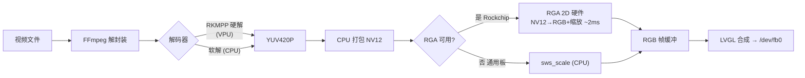

# LVGL Video Player

基于 LVGL 的嵌入式 Linux 视频播放器（C++）：FFmpeg 解码 → LVGL 上屏 + ALSA 音频。
支持硬解加速、音画同步、播放/暂停/进度、文件浏览器、旋转角与任意分辨率自适应、
运行时截图。RK3566 @ 1080p 实测 ~36fps。

> A C++ LVGL video player for embedded Linux framebuffers: FFmpeg decode to
> screen + ALSA audio, with A/V sync, play/pause/seek, rotation, a file
> browser playlist and one-click screenshots.

## 快速上手

```sh
git clone --recurse-submodules https://github.com/ZhangKeLiang0627/lvgl-video-player
cd lvgl-video-player

cmake -S . -B build          # 默认 Release；加 -DFFMPEG_PREFIX=/opt/ffmpeg-rkmp 走 RKMPP 硬解
cmake --build build -j
./build/lvgl-video-player    # 默认竖屏；-r 90 横屏；--shot /tmp/ui.png 截一张图
```

依赖一键装齐（Ubuntu / Debian）：

```sh
sudo apt install -y cmake g++ pkg-config git \
    libavformat-dev libavcodec-dev libavutil-dev libswscale-dev libswresample-dev \
    libasound2-dev zlib1g-dev
```

检查：`pkg-config --modversion libavformat` 有版本号即就绪（librga 仅 Rockchip 板需要，
通用 PC 构建自动跳过、走 CPU 软解）。

## 原理：视频输出链路

解码与像素转换各自独立选择，软/硬解共用同一条上屏管道：



- **解码**：优先 `h264_rkmpp` / `hevc_rkmpp` 硬解，找不到自动回退软解
- **转换**：优先 RGA 2D 硬件，不可用（通用板）自动回退 CPU `sws_scale`
- 同一份二进制在普通板子上运行自动走软解，不会报错

## 预览

| 竖屏 0°（RK3566，800×1280） | 横屏 90°（RK3566，1280×800） | SDL 桌面仿真（1280×800） |
| :---: | :---: | :---: |
|  |  |  |

截图均由内置截屏工具在真机 / 桌面仿真运行中抓取（演示视频含实时时间戳与滚动文字）。

## 操作：运行参数 & 截图

| 参数 | 作用 |
|------|------|
| `-r <deg>` / `--rotate` | 旋转角 0/90/180/270；`LVGL_ROTATE=<deg>` 环境变量等价 |
| `--shot <file>` | 启动 2s 后截一张 PNG 到指定文件 |
| `--shot-dir <dir> [--shot-period <sec>]` | 周期截屏（默认每 5s，`shot_NNN.png`） |
| `PLAYER_VIDEO=<path>` | 覆盖默认播放文件（SDL 仿真必备） |
| `Shot` 按钮（Play 旁） | 一键截图 → `/tmp/shot_YYYYMMDD_HHMMSS_mmm_WxH.png` |

截图命名：`shot_<年月日_时分秒>_<毫秒>_<宽x高>.png`——毫秒防连点重名，分辨率后缀
区分横/竖屏，例如 `shot_20260817_183045_712_1280x800.png`。

分辨率自适应：播放器从 `/dev/fb0` 读取真实尺寸，控件按 `spct(宽/高, 百分比)` 布局，
换任意分辨率屏幕无需改代码；触摸坐标由 LVGL 按旋转自动映射。

## 进阶

- **桌面仿真（PC 预览 UI）**：`cmake -S . -B build/sdl -DENABLE_SDL=ON`，默认
  1280×800 窗口、鼠标模拟触摸，无需真机
- **交叉编译（aarch64）**：加 `-DCMAKE_TOOLCHAIN_FILE=cmake/aarch64-linux-gnu.cmake`
- **配置**：编辑 `src/config.h`（默认视频、触摸设备、音量增益等；头文件与源码同目录）
- **RKMPP 硬解 FFmpeg**：Rockchip 定制 deb 已随 `docs/ffmpeg-rkmp/` 分发，解包到
  独立前缀目录（勿解包到系统 `/`），见仓库 Release 页

## 已知限制

- RK3566 主循环为无 syscall 紧凑轮询，视频 ~36fps（略快于 30fps），kiosk 场景可接受
- `lv_ffmpeg` 补丁针对 LVGL v9.5.0，升级 LVGL 需重新评估

## License

MIT —— 见 [LICENSE](LICENSE)。
