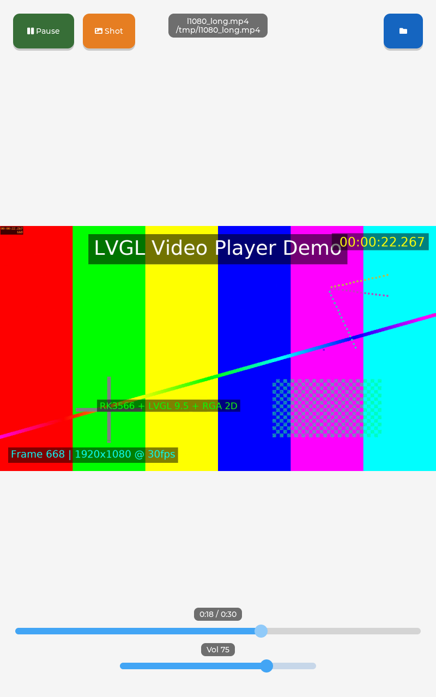
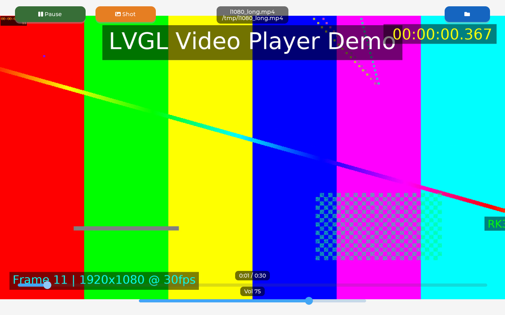
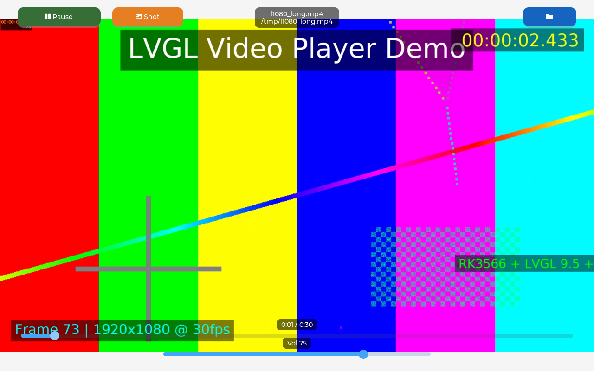
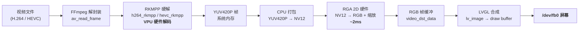
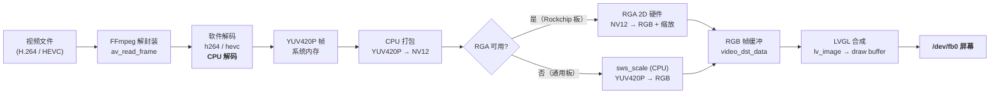

# LVGL Video Player

基于 LVGL 的嵌入式 Linux 帧缓冲视频播放器（C++）：FFmpeg 解码 → 屏幕显示 + ALSA 音频，
支持音画同步、播放/暂停、可拖动进度条、音量调节和文件浏览器。

> A C++ LVGL video player for embedded Linux framebuffers: FFmpeg decode to
> screen + ALSA audio, with A/V sync, play/pause, seek, volume and a file
> browser playlist.

## 特性

- FFmpeg 解码 + **Rockchip RGA 2D 加速**上屏（RK3566 @ 1080p 实测 ~36fps）
- 可选 **RKMPP 硬解**（使用 Rockchip 定制版 FFmpeg）
- 进程内 ALSA 音频线程，音画同属一个墙钟（A/V 同步）
- 播放 / 暂停、可拖动进度条、音量滑块、文件浏览器 / 播放列表
- LVGL sysmon 帧率 / 内存监视器
- **分辨率自适应 + 启动旋转角**：任意面板分辨率 + `-r 0/90/180/270`，
  控件全部按屏宽高百分比布局
- **运行时截屏工具**（`utils/lv_snapshot`）：导出 PNG 用于 README 预览 / 调试
  - **快捷按钮**：Play 旁的橙色 "Shot" 按钮一键截图
  - **专业命名**：`shot_YYYYMMDD_HHMMSS_mmm_WxH.png`（时间戳 ms 避免重名 + 分辨率后缀区分横竖屏）
- **桌面 SDL 仿真**（`-DENABLE_SDL=ON`，默认 1280×800）：PC 上免真机预览
  UI，鼠标模拟触摸，非 Rockchip 平台自动关 RGA 走 CPU 软解
- **aarch64 交叉编译**：`cmake/aarch64-linux-gnu.cmake` toolchain 文件

## 预览

| 竖屏 0°（800×1280 默认） | 横屏 90°（1280×800 旋转） | SDL 桌面仿真（1280×800） |
| :---: | :---: | :---: |
|  |  |  |
| `./demo` | `./demo -r 90` | `cmake -DENABLE_SDL=ON` 在 PC 运行 |

三张截图都由 `utils/lv_snapshot` 在真机/桌面仿真运行中抓取（同样的 `spct()` 百分比
布局在三端一致），彩色测试视频由 ffmpeg `testsrc2` + `drawtext` 生成（实时时间戳、
滚动文字、标题、帧号 + 440Hz 音轨）。

## 视频输出链路

解码阶段与像素转换阶段各自独立选择：**解码**在 RKMPP 硬解 / 软解之间
运行时自动切换；**像素转换**优先用 RGA 2D 硬件，不可用时回退 CPU
`sws_scale`。因此软解、硬解共用同一条 LVGL 上屏管道，最终都输出到
`/dev/fb0`。

### 硬解码链路（Rockchip FFmpeg + RKMPP，RK35xx 默认路径）



### 软解码链路（系统 FFmpeg，或硬解器不可用时自动回退）



| 阶段 | 硬解码 | 软解码 |
|------|--------|--------|
| 解码 | RKMPP（VPU 硬件，CPU 占用低） | FFmpeg 软解（CPU 占用高） |
| 像素转换 | RGA 2D 硬件（~2ms @ 1080p） | 同左（Rockchip 板）/ `sws_scale`（通用板） |
| 最终输出 | `/dev/fb0` | `/dev/fb0` |

> 无论哪条链路，解码出的帧最终都写入同一份 RGB 缓冲，交给 LVGL 合成后
> 一次性写入 `/dev/fb0`，所以「硬解构建」的产物在普通板子上运行会自动
> 走软解码 + `sws_scale`，不会报错。

## 依赖

| 依赖 | 用途 | 安装（Ubuntu / Debian） | 检查是否就绪 |
|------|------|------------------------|--------------|
| LVGL v9.5.0 | GUI 框架 | git submodule，clone 时自动拉取 | `git submodule status` 显示 `c65e112...` |
| FFmpeg 开发包 | 视频解码 | `sudo apt install libavformat-dev libavcodec-dev libavutil-dev libswscale-dev libswresample-dev` | `pkg-config --modversion libavformat` 输出版本号 |
| librga | RGA 2D 加速（YUV→RGB） | Rockchip 镜像自带；否则 `sudo apt install librga-dev` | `ls /usr/include/rga/rga.h` 存在 |
| ALSA 开发包 | 音频输出 | `sudo apt install libasound2-dev` | `ls /usr/include/alsa/asoundlib.h` 存在 |
| zlib | 截屏工具 PNG 编码（utils/lv_snapshot） | Ubuntu 自带（`libz`）；否则 `sudo apt install zlib1g-dev` | `ls /usr/include/zlib.h` 存在 |
| libsdl2-dev（可选） | 桌面 SDL 仿真（`-DENABLE_SDL=ON`） | `sudo apt install libsdl2-dev` | `pkg-config --modversion sdl2` 输出版本号 |
| 构建工具 | 编译 | `sudo apt install cmake g++ pkg-config git` | `cmake --version` 输出版本号 |

**可选 — RKMPP 硬件解码**：系统自带的 FFmpeg 通常没有 `h264_rkmpp` 硬解器，
需要 Rockchip 定制版 FFmpeg。`docs/ffmpeg-rkmp/ffmpeg-rkmp-4.2.4-arm64-debs.tar.gz`
已内置全部 deb（也可从仓库 Release 页面下载）。解包到独立前缀目录
`/opt/ffmpeg-rkmp`（勿解包到系统 `/`，会覆盖系统 FFmpeg）：

```sh
mkdir -p /opt/ffmpeg-rkmp /tmp/ffrk && tar xzf docs/ffmpeg-rkmp/ffmpeg-rkmp-4.2.4-arm64-debs.tar.gz -C /tmp/ffrk
cd /tmp/ffrk && for d in *.deb; do dpkg-deb -x "$d" /opt/ffmpeg-rkmp; done
```

检查：`ls /opt/ffmpeg-rkmp/usr/lib/aarch64-linux-gnu/pkgconfig/` 能看到
`libavcodec.pc` 等文件；`ffmpeg -decoders | grep rkmpp` 能看到 `h264_rkmpp`。

## 目录结构

```text
lvgl-video-player/
├── src/                        # 全部源码与头文件（无独立 include/ 目录）
│   ├── App.*   Ui.*   Player.*
│   ├── AudioEngine.*  FileBrowser.*
│   ├── screen.*                # 运行时屏幕几何 + spct() 百分比布局 helper
│   ├── config.h                # 编译期配置（头文件与源码同目录）
│   ├── main.cpp
│   └── utils/
│       └── lv_snapshot.*       # 截屏工具：抓取 LVGL 快照 → PNG（zlib）
├── lv_conf.h                   # LVGL 配置（构建自动引用）
├── cmake/
│   └── aarch64-linux-gnu.cmake # aarch64 交叉编译 toolchain
├── patches/lv_ffmpeg/          # lv_ffmpeg.c 补丁（RGA 加速、暂停/seek 等）
├── docs/                       # README 截图、RKMPP FFmpeg deb 包
├── CMakeLists.txt              # 主构建（-DENABLE_SDL / -DFFMPEG_PREFIX）
└── Makefile                    # 板载构建（可选，RK3566 实测）
```

`lvgl/` 为 git submodule（v9.5.0，构建时自动打补丁）。

## 构建（CMake）

```sh
git clone --recurse-submodules https://github.com/ZhangKeLiang0627/lvgl-video-player
cd lvgl-video-player

# 软解（系统 FFmpeg，通用板子）
cmake -S . -B build -DCMAKE_BUILD_TYPE=Release

# 硬解（Rockchip FFmpeg + RKMPP）
cmake -S . -B build -DCMAKE_BUILD_TYPE=Release -DFFMPEG_PREFIX=/opt/ffmpeg-rkmp

cmake --build build -j
./build/lvgl-video-player
```

### 桌面 SDL 仿真（PC 上预览 UI，默认 1280×800）

无需真机即可运行：`-DENABLE_SDL=ON` 启用 LVGL 的 SDL 窗口后端（1280×800），
用鼠标模拟触摸。PC 上没有 librga 时会自动关闭 RGA、走 CPU `sws_scale`
（`lv_ffmpeg.c` 的 RGA 代码已用 `LV_FFMPEG_USE_RGA` 条件编译隔离）。

```sh
sudo apt install -y libsdl2-dev libavformat-dev libavcodec-dev \
    libavutil-dev libswscale-dev libswresample-dev libasound2-dev zlib1g-dev

cmake -S . -B build/sdl -DCMAKE_BUILD_TYPE=Release -DENABLE_SDL=ON
cmake --build build/sdl -j"$(nproc)"

PLAYER_VIDEO=/path/to/video.mp4 ./build/sdl/lvgl-video-player   # 指定播放文件
./build/sdl/lvgl-video-player -r 90                             # 窗口内旋转预览
```

`PLAYER_VIDEO` 环境变量可覆盖默认视频路径（真机默认 `/tmp/l1080_long.mp4`，
PC 上没有该文件时用它可以指定本地视频）。

### 交叉编译（aarch64，如 RK35xx 板子）

```sh
sudo apt install -y g++-aarch64-linux-gnu

cmake -S . -B build/arm64 \
    -DCMAKE_TOOLCHAIN_FILE=cmake/aarch64-linux-gnu.cmake \
    -DCMAKE_BUILD_TYPE=Release
cmake --build build/arm64 -j"$(nproc)"
```

toolchain 文件见 `cmake/aarch64-linux-gnu.cmake`（参考
[Keyboard-Guide](https://github.com/ZhangKeLiang0627/Keyboard-Guide) 的规范）。
注意交叉编译需自行准备 aarch64 的 FFmpeg/ALSA dev 包（sysroot），或用
`-DFFMPEG_PREFIX` 指向设备侧的 Rockchip FFmpeg 前缀目录。

CMake 在 configure 阶段会自动给 LVGL 的 `lv_ffmpeg.c` 打补丁
（RGA 加速 + 暂停 / 进度 / 时长支持），无需手动操作。

> **软解 / 硬解是自动区分的**：同一份二进制在运行时优先探测
> `h264_rkmpp` / `hevc_rkmpp` 硬解器，找不到则回退系统软解；像素转换
> 优先用 Rockchip RGA 2D 加速，RGA 不可用（如非 Rockchip 板子）时自动
> 回退 CPU `sws_scale`。因此「硬解」构建产物（`-DFFMPEG_PREFIX=...`）在
> 普通板子上也能跑（走软解），不会报错。

## 配置

编辑 `src/config.h`（头文件与源码同目录）或用编译宏覆盖：

| 宏 | 默认值 | 说明 |
|----|--------|------|
| `VIDEO_PATH` | `/tmp/l1080_long.mp4` | 默认播放文件 |
| `TOUCH_DEV` | `/dev/input/event1` | 触摸屏输入设备 |
| `AUDIO_DEV` | `plughw:0,0` | ALSA 播放设备 |
| `ROOT_DIR` | `/userdata` | 文件浏览器根目录 |
| `VOL_MAX_GAIN` | `2.0f` | 音量滑块最大增益 |
| `DEFAULT_ROTATION` | `0` | 默认显示旋转角（0/90/180/270），`-r` / `LVGL_ROTATE` 可覆盖 |

## 分辨率适配

播放器**不写死屏幕尺寸**：启动时从 `/dev/fb0` 读取真实分辨率，并按
`-r` 旋转角换算成逻辑分辨率（90/270 时宽高互换）。所有控件——按钮、
进度条、音量条、标题、文件浏览器——都通过 `spct(W|H, 百分比)` 相对
屏宽/屏高布局。因此换一块不同分辨率的板子（如 320×240 小屏）无需改
任何代码，控件比例自动保持一致：

| 屏（物理） | 旋转 | 逻辑分辨率 | 视频 contain-fit |
|------|------|-----------|------------------|
| 800×1280 | 0°（默认） | 800×1280 | 800×450 |
| 800×1280 | 90° | 1280×800 | 1280×720 |

触摸坐标由 LVGL 按旋转自动映射，无需额外处理。

## 运行与截屏

```sh
./build/lvgl-video-player                          # 竖屏（默认 0°）
./build/lvgl-video-player -r 90                    # 横屏（顺时针 90°）
./build/lvgl-video-player --rotate 270             # 270°
LVGL_ROTATE=180 ./build/lvgl-video-player          # 环境变量方式
```

| 参数 | 说明 |
|------|------|
| `-r <deg>` / `--rotate <deg>` | 旋转角 0/90/180/270（默认 `DEFAULT_ROTATION`） |
| `--shot <file>` | 启动 2s 后截一张屏到 PNG（README 预览图即由此生成） |
| `--shot-dir <dir> [--shot-period <sec>]` | 周期性截屏到 `<dir>/shot_NNN.png`（默认每 5s） |
| `Shot` 按钮（Play 旁） | 一键截图，落盘到 `/tmp/shot_YYYYMMDD_HHMMSS_mmm_WxH.png`（见下） |
| `PLAYER_VIDEO=<path>` | 环境变量覆盖默认播放文件（SDL 仿真必备） |
| `LVGL_ROTATE=<deg>` | 环境变量设置旋转角，等价于 `-r` |

**`Shot` 按钮命名规则** `shot_<YYYYMMDD>_<HHMMSS>_<mmm>_<WxH>.png`：
- `YYYYMMDD_HHMMSS`：本地墙钟时间，文件按时间自然排序
- `mmm`：毫秒（0–999），保证连按不重名
- `WxH`：当前逻辑分辨率（旋转后），一眼区分横/竖屏

例：`shot_20260817_183045_712_1280x800.png`。

截屏由 `utils/lv_snapshot` 提供：`lv_snapshot_take()` 抓取当前屏快照为
RGB888 帧，再用手写 zlib 编码器生成真彩色 PNG（仅依赖 `libz`，不引入
libpng）。也可在代码里直接调用：

```cpp
#include "utils/lv_snapshot.h"
lv_snapshot_save_png(lv_screen_active(), "/tmp/ui.png");
```

## 已知限制

- 主循环为紧凑轮询（无 syscall），视频以略快于 30fps 的速度播放（~36fps），
  对 kiosk 循环播放可接受；单核 CPU 占用约 100%。
- 补丁针对 LVGL v9.5.0；升级 LVGL 需重新评估补丁是否仍适用。

## License

MIT —— 见 [LICENSE](LICENSE)。
