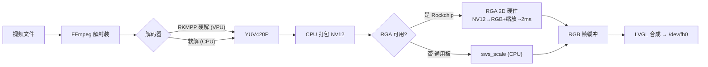

# LVGL Video Player

基于 LVGL 的嵌入式 Linux 视频播放器（C++）：FFmpeg 解码 → LVGL 上屏 + ALSA 音频。
支持硬解加速（RKMPP）、帧时钟锁帧（23.976/24/25/30fps 播放节奏稳定不抖）、
音画同步、播放/暂停/进度拖拽、文件浏览器、旋转角与任意分辨率自适应、运行时截图。


> A C++ LVGL video player for embedded Linux framebuffers: FFmpeg decode to
> screen + ALSA audio, with A/V sync, frame-clock paced playback (stable
> cadence for 23.976/24/25/30 fps), play/pause/seek, rotation, a file
> browser playlist and one-click screenshots.

## 快速上手：编译与运行

仓库默认构建产物为 `lvgl-video-player`（或 `./demo`）。以下几步是编译，按你的
目标平台选一种：

### ① 准备：安装依赖（Ubuntu / Debian）

```sh
sudo apt install -y cmake g++ pkg-config git \
    libavformat-dev libavcodec-dev libavutil-dev libswscale-dev libswresample-dev \
    libasound2-dev zlib1g-dev
```

检查就绪：`pkg-config --modversion libavformat` 应输出版本号。

> 可选：SDL 桌面仿真另需 `libsdl2-dev`（见 ③）；Rockchip 硬解需板子自带 librga 与
> 仓库分发的 RKMPP FFmpeg deb（见文末「依赖」）。

### ② 机器本地编译（真机 / 通用 Linux）

```sh
git clone --recurse-submodules https://github.com/ZhangKeLiang0627/lvgl-video-player-demo
cd lvgl-video-player-demo

# 软解（系统 FFmpeg，通用板子）
cmake -S . -B build
# 硬解（Rockchip FFmpeg + RKMPP，需先解包 deb 到独立前缀目录）
cmake -S . -B build -DFFMPEG_PREFIX=/opt/ffmpeg-rkmp

cmake --build build -j
./build/lvgl-video-player        # 默认竖屏；-r 90 横屏；--shot /tmp/ui.png 截一张图
```

### ③ SDL 桌面仿真（PC 上预览 UI，免真机）

```sh
sudo apt install -y libsdl2-dev
cmake -S . -B build/sdl -DENABLE_SDL=ON
cmake --build build/sdl -j"$(nproc)"
PLAYER_VIDEO=/path/to/video.mp4 ./build/sdl/lvgl-video-player   # 1280×800 窗口，鼠标当触摸
```

### ④ 交叉编译（aarch64 板子，如 RK35xx）

```sh
sudo apt install -y g++-aarch64-linux-gnu
cmake -S . -B build/arm64 -DCMAKE_TOOLCHAIN_FILE=cmake/aarch64-linux-gnu.cmake
cmake --build build/arm64 -j"$(nproc)"
```

## 原理

解码与像素转换各自独立选择，软/硬解共用同一条上屏管道，最终写入 `/dev/fb0`：



- **解码**：优先 `h264_rkmpp`/`hevc_rkmpp` 硬解，找不到自动回退软解。
  （不尝试 `v4l2m2m`：桌面发行版带这些 wrapper 但无 `/dev/video` 节点，open 失败
  会污染解码器状态、导致播放反复重启卡死——见 `patches/lv_ffmpeg/README.md`。）
- **转换**：优先 RGA 2D 硬件，不可用（通用板）自动回退 CPU `sws_scale`
- **呈现节奏**：帧时钟锁帧——解码一帧超前、到帧边界才上屏，上屏节奏与解码耗时
  解耦，23.976fps 等片源不再因解码抖动而一顿一顿
- 同一份二进制在普通板子上运行自动走软解，不会报错；`-DENABLE_SDL=ON` 可在 PC
  桌面仿真（行为与真机一致：锁帧、换片源、进度条拖拽均正常）

## 预览

| 竖屏 0°（RK3566，800×1280） | 横屏 90°（RK3566，1280×800） | SDL 桌面仿真（1280×800） |
| :---: | :---: | :---: |
|  |  |  |

截图均由内置截屏工具在真机 / 桌面仿真运行中抓取（演示视频含实时时间戳与滚动文字）。
若图片无法加载（网络原因），原件在 `docs/screenshots/` 目录可直接查看。

## 操作：运行参数 & 截图

| 参数 | 作用 |
|------|------|
| `-r <deg>` / `--rotate` | 旋转角 0/90/180/270；`LVGL_ROTATE=<deg>` 环境变量等价 |
| `--shot <file>` | 启动 2s 后截一张 PNG 到指定文件 |
| `--shot-dir <dir> [--shot-period <sec>]` | 周期截屏（默认每 5s，`shot_NNN.png`） |
| `PLAYER_VIDEO=<path>` | 覆盖默认播放文件（SDL 仿真必备） |
| `Shot` 按钮（Play 旁） | 一键截图 → `/tmp/shot_YYYYMMDD_HHMMSS_mmm_WxH.png` |

截图命名：`shot_<年月日_时分秒>_<毫秒>_<宽x高>.png`——毫秒防连点重名，分辨率后缀
区分横/竖屏，例如 `shot_20260817_183045_712_1280x800.png`。

分辨率自适应：播放器从 `/dev/fb0` 读取真实尺寸，控件按 `spct(宽/高, 百分比)` 布局，
换任意分辨率屏幕无需改代码；触摸坐标由 LVGL 按旋转自动映射。

配置：编辑 `src/config.h`（默认视频、触摸设备、音量增益、默认旋转角等）。

## 目录结构

```text
lvgl-video-player/
├── src/                        # 全部源码与头文件（无独立 include/ 目录）
│   ├── App.*  Ui.*  Player.*  AudioEngine.*  FileBrowser.*
│   ├── screen.*                # 运行时屏幕几何 + spct() 百分比布局
│   ├── config.h                # 编译期配置
│   ├── main.cpp
│   └── utils/lv_snapshot.*     # 截屏工具：LVGL 快照 → PNG（zlib）
├── lv_conf.h                   # LVGL 配置（构建自动引用）
├── cmake/aarch64-linux-gnu.cmake   # 交叉编译 toolchain
├── patches/lv_ffmpeg/          # lv_ffmpeg.c 补丁（RGA 加速、暂停/seek 等）
├── docs/                       # 预览截图、RKMPP FFmpeg deb 包
├── CMakeLists.txt              # 主构建（ENABLE_SDL / FFMPEG_PREFIX）
└── Makefile                    # 板载构建（可选）
```

`lvgl/` 为 git submodule（v9.5.0，构建时自动打补丁）。

## 依赖

| 依赖 | 用途 | 安装（Ubuntu / Debian） | 检查是否就绪 |
|------|------|------------------------|--------------|
| LVGL v9.5.0 | GUI 框架 | git submodule，clone 时自动拉取 | `git submodule status` 显示 `c65e112...` |
| FFmpeg 开发包 | 视频解码 | `sudo apt install libavformat-dev libavcodec-dev libavutil-dev libswscale-dev libswresample-dev` | `pkg-config --modversion libavformat` 输出版本号 |
| librga | RGA 2D 加速（YUV→RGB） | Rockchip 镜像自带；否则 `sudo apt install librga-dev` | `ls /usr/include/rga/rga.h` 存在 |
| ALSA 开发包 | 音频输出 | `sudo apt install libasound2-dev` | `ls /usr/include/alsa/asoundlib.h` 存在 |
| zlib | 截屏工具 PNG 编码 | Ubuntu 自带（`libz`）；否则 `sudo apt install zlib1g-dev` | `ls /usr/include/zlib.h` 存在 |
| libsdl2-dev（可选） | SDL 桌面仿真（`-DENABLE_SDL=ON`） | `sudo apt install libsdl2-dev` | `pkg-config --modversion sdl2` 输出版本号 |
| 构建工具 | 编译 | `sudo apt install cmake g++ pkg-config git` | `cmake --version` 输出版本号 |

> 非 Rockchip 板（无 librga）构建时自动跳过 RGA、走 CPU `sws_scale`，无需安装。

**可选 — RKMPP 硬解 FFmpeg**：Rockchip 定制 deb 已随 `docs/ffmpeg-rkmp/` 分发
（也可从仓库 Release 页下载），解包到独立前缀目录（勿解包到系统 `/`，会覆盖系统
FFmpeg）：

```sh
mkdir -p /opt/ffmpeg-rkmp /tmp/ffrk && tar xzf docs/ffmpeg-rkmp/ffmpeg-rkmp-4.2.4-arm64-debs.tar.gz -C /tmp/ffrk
cd /tmp/ffrk && for d in *.deb; do dpkg-deb -x "$d" /opt/ffmpeg-rkmp; done
```

检查：`ffmpeg -decoders | grep rkmpp` 能看到 `h264_rkmpp`。

## 已知限制

- RK3566 主循环为无 syscall 紧凑轮询；视频呈现按片源帧时钟锁帧（每帧在上屏边界
  精确上屏），解码耗时波动不再影响播放节奏。23.976fps 片源在 59.37Hz 面板上仍有
  物理 3:2 重复模式（帧率与刷新率非整数倍），抖动已均匀化、无法完全消除
- `lv_ffmpeg` 补丁针对 LVGL v9.5.0，升级 LVGL 需重新评估
- 桌面 SDL 仿真为软解（无 RKMPP/RGA），适合验证 UI 与交互，解码性能不代表真机

## License

MIT —— 见 [LICENSE](LICENSE)。
