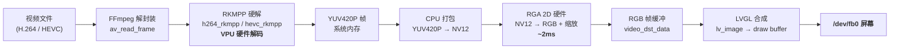
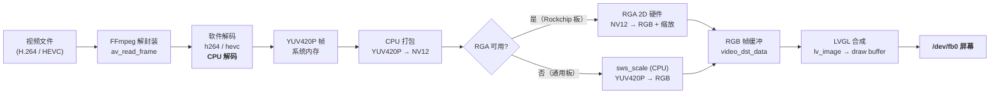

# LVGL Video Player

基于 LVGL 的嵌入式 Linux 帧缓冲视频播放器（C++）：FFmpeg 解码 → 屏幕显示 + ALSA 音频，
支持音画同步、播放/暂停、可拖动进度条、音量调节和文件浏览器。

> A C++ LVGL video player for embedded Linux framebuffers: FFmpeg decode to
> screen + ALSA audio, with A/V sync, play/pause, seek, volume and a file
> browser playlist.

## 特性

- FFmpeg 解码 + **Rockchip RGA 2D 加速**上屏（RK3566 @ 1080p 实测 ~36fps）
- 可选 **RKMPP 硬解**（使用 Rockchip 定制版 FFmpeg）
- 进程内 ALSA 音频线程，音画同属一个墙钟（A/V 同步）
- 播放 / 暂停、可拖动进度条、音量滑块、文件浏览器 / 播放列表
- LVGL sysmon 帧率 / 内存监视器
- **分辨率自适应 + 启动旋转角**：任意面板分辨率 + `-r 0/90/180/270`，
  控件全部按屏宽高百分比布局
- **运行时截屏工具**（`utils/lv_snapshot`）：导出 PNG 用于 README 预览 / 调试

## 预览

| 竖屏 0°（800×1280 默认） | 横屏 90°（1280×800 旋转） |
| :---: | :---: |
|  |  |
| `./demo` | `./demo -r 90` |

两张截图都由 `utils/lv_snapshot` 在 RK3566 真机上抓取（视频帧正在播放）。

## 视频输出链路

解码阶段与像素转换阶段各自独立选择：**解码**在 RKMPP 硬解 / 软解之间
运行时自动切换；**像素转换**优先用 RGA 2D 硬件，不可用时回退 CPU
`sws_scale`。因此软解、硬解共用同一条 LVGL 上屏管道，最终都输出到
`/dev/fb0`。

### 硬解码链路（Rockchip FFmpeg + RKMPP，RK35xx 默认路径）



### 软解码链路（系统 FFmpeg，或硬解器不可用时自动回退）



| 阶段 | 硬解码 | 软解码 |
|------|--------|--------|
| 解码 | RKMPP（VPU 硬件，CPU 占用低） | FFmpeg 软解（CPU 占用高） |
| 像素转换 | RGA 2D 硬件（~2ms @ 1080p） | 同左（Rockchip 板）/ `sws_scale`（通用板） |
| 最终输出 | `/dev/fb0` | `/dev/fb0` |

> 无论哪条链路，解码出的帧最终都写入同一份 RGB 缓冲，交给 LVGL 合成后
> 一次性写入 `/dev/fb0`，所以「硬解构建」的产物在普通板子上运行会自动
> 走软解码 + `sws_scale`，不会报错。

## 依赖

| 依赖 | 用途 | 安装（Ubuntu / Debian） | 检查是否就绪 |
|------|------|------------------------|--------------|
| LVGL v9.5.0 | GUI 框架 | git submodule，clone 时自动拉取 | `git submodule status` 显示 `c65e112...` |
| FFmpeg 开发包 | 视频解码 | `sudo apt install libavformat-dev libavcodec-dev libavutil-dev libswscale-dev libswresample-dev` | `pkg-config --modversion libavformat` 输出版本号 |
| librga | RGA 2D 加速（YUV→RGB） | Rockchip 镜像自带；否则 `sudo apt install librga-dev` | `ls /usr/include/rga/rga.h` 存在 |
| ALSA 开发包 | 音频输出 | `sudo apt install libasound2-dev` | `ls /usr/include/alsa/asoundlib.h` 存在 |
| 构建工具 | 编译 | `sudo apt install cmake g++ pkg-config git` | `cmake --version` 输出版本号 |

**可选 — RKMPP 硬件解码**：系统自带的 FFmpeg 通常没有 `h264_rkmpp` 硬解器，
需要 Rockchip 定制版 FFmpeg。`docs/ffmpeg-rkmp/ffmpeg-rkmp-4.2.4-arm64-debs.tar.gz`
已内置全部 deb（也可从仓库 Release 页面下载）。解包到独立前缀目录
`/opt/ffmpeg-rkmp`（勿解包到系统 `/`，会覆盖系统 FFmpeg）：

```sh
mkdir -p /opt/ffmpeg-rkmp /tmp/ffrk && tar xzf docs/ffmpeg-rkmp/ffmpeg-rkmp-4.2.4-arm64-debs.tar.gz -C /tmp/ffrk
cd /tmp/ffrk && for d in *.deb; do dpkg-deb -x "$d" /opt/ffmpeg-rkmp; done
```

检查：`ls /opt/ffmpeg-rkmp/usr/lib/aarch64-linux-gnu/pkgconfig/` 能看到
`libavcodec.pc` 等文件；`ffmpeg -decoders | grep rkmpp` 能看到 `h264_rkmpp`。

## 构建（CMake）

```sh
git clone --recurse-submodules https://github.com/ZhangKeLiang0627/lvgl-video-player
cd lvgl-video-player

# 软解（系统 FFmpeg，通用板子）
cmake -S . -B build -DCMAKE_BUILD_TYPE=Release

# 硬解（Rockchip FFmpeg + RKMPP）
cmake -S . -B build -DCMAKE_BUILD_TYPE=Release -DFFMPEG_PREFIX=/opt/ffmpeg-rkmp

cmake --build build -j
./build/lvgl-video-player
```

CMake 在 configure 阶段会自动给 LVGL 的 `lv_ffmpeg.c` 打补丁
（RGA 加速 + 暂停 / 进度 / 时长支持），无需手动操作。

> **软解 / 硬解是自动区分的**：同一份二进制在运行时优先探测
> `h264_rkmpp` / `hevc_rkmpp` 硬解器，找不到则回退系统软解；像素转换
> 优先用 Rockchip RGA 2D 加速，RGA 不可用（如非 Rockchip 板子）时自动
> 回退 CPU `sws_scale`。因此「硬解」构建产物（`-DFFMPEG_PREFIX=...`）在
> 普通板子上也能跑（走软解），不会报错。

## 配置

编辑 `include/config.h` 或用编译宏覆盖：

| 宏 | 默认值 | 说明 |
|----|--------|------|
| `VIDEO_PATH` | `/userdata/my_test.mp4` | 默认播放文件 |
| `TOUCH_DEV` | `/dev/input/event1` | 触摸屏输入设备 |
| `AUDIO_DEV` | `plughw:0,0` | ALSA 播放设备 |
| `ROOT_DIR` | `/userdata` | 文件浏览器根目录 |
| `VOL_MAX_GAIN` | `2.0f` | 音量滑块最大增益 |

## 运行与截屏

```sh
./build/lvgl-video-player                        # 竖屏（默认）
./build/lvgl-video-player -r 90                  # 横屏
./build/lvgl-video-player --shot /tmp/ui.png     # 启动 2s 后截一张到 PNG
./build/lvgl-video-player --shot-dir /tmp/shots --shot-period 3
                                                  # 每 3s 截一张到 /tmp/shots/shot_NNN.png
```

`--shot` / `--shot-dir` 由 `utils/lv_snapshot` 提供：`lv_snapshot_take()`
抓取当前屏快照为 RGB888 帧，再用手写 zlib 编码器生成真彩色 PNG（仅依赖
`libz`，不引入 libpng）。也可在代码里直接调用：

```cpp
#include "utils/lv_snapshot.h"
lv_snapshot_save_png(lv_screen_active(), "/tmp/ui.png");
```

环境变量 `LVGL_ROTATE=270` 也可设置默认旋转角（与 `-r` 等价）。

## 已知限制

- 主循环为紧凑轮询（无 syscall），视频以略快于 30fps 的速度播放（~36fps），
  对 kiosk 循环播放可接受；单核 CPU 占用约 100%。
- 补丁针对 LVGL v9.5.0；升级 LVGL 需重新评估补丁是否仍适用。

## License

MIT —— 见 [LICENSE](LICENSE)。
